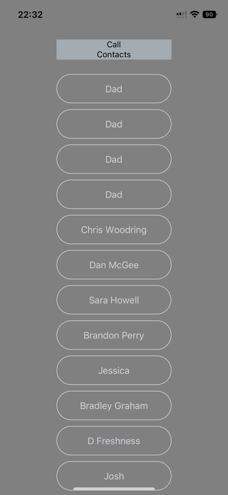

# Lab 41 React Native-Milestone 1: MVP

Create your first native phone/device application using React Native, tapping into at least 2 phone features.

## Assignment

- Over the next 2 lab coding sessions, you will create your first Phone App. What it does and how it looks is up to you. This is an opportunity to play around with whats possible in React Native and to get a feel for how you can get into the various device features.

- This is a 2-session assignment, after which you will live-demo your phone app to the class (at the start of class 43)

- Lab/Coding Session #1 - Focus on getting your dev system up and operational, getting “proof of life” and reaching your MVP in terms of baseline functionality

- Lab/Coding Session #2 - Add in the device features, polish, and prepare for deployments.

## Requirements

- Use at least 1 native device feature (Contacts, Camera, GPS, etc)
- High Fidelity Styling and UX
  - Good starting points:
    - Native Base
    - Builder X
- Properly Documented for End Users
- Live Demo & Presentation

## Milestone 1-MVP(This Lab)

- Deliver your MVP for raw functionality
- Your dev environment should be properly working
- Other users should be able to scan your QR and see your app on any device
- All of your core “features” should be working properly
  - Un-Styled is fine. We’re looking for things to buzz, light up, detect movement, etc.

## Application Requirements

- Use 2 screens / components
- Use and share state between components/screens
- Use at least 1 native device feature (Contacts, Camera, GPS, etc)
- Properly Documented for End Users
- Live Demo & Presentation

## Milestone 2 - Product Delivery (This Lab)

- Quality and Thoughtful Styling using css-in-js
- Right sized tap targets, good contrast
- Dark and Light Modes
- Well thought through UX
  - Be considerate of individuals that primarily use their thumbs, left or right hands

## Credits

- [Junyoung Son](https://github.com/Junyoungson808)

## UML/Screenshot

